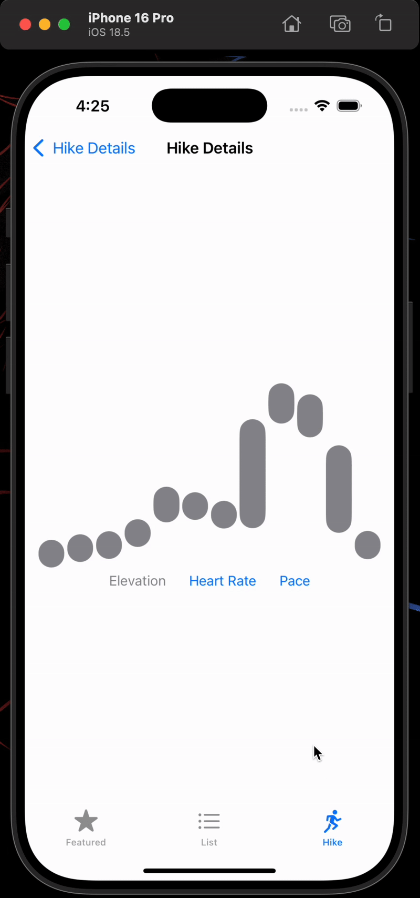
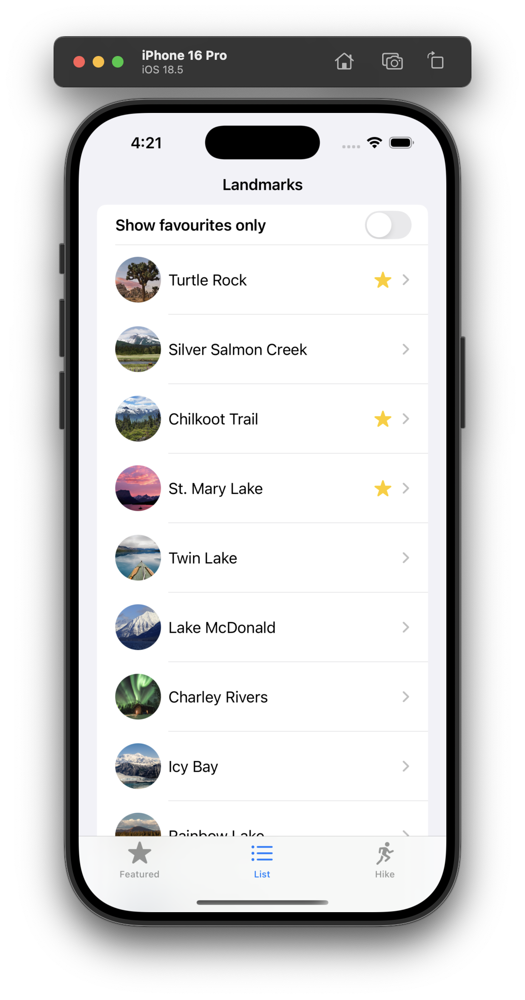

# 📱 SwiftUI Demo Project

A beginner-friendly iOS application built with **SwiftUI** to learn and showcase modern iOS development skills. This project is designed as a learning playground for experimenting with SwiftUI, REST API integration, permissions, and more.

---

## 🚀 Features

- SwiftUI-based UI components
- **Tabbed Navigation:** Two main tabs—Featured and List—allow users to switch between a curated set of highlights and a full list of landmarks
- **Landmark List & Detail Views:** Explore a list of landmarks with detailed screens for each item, demonstrating navigation and data flow
- **Category-Based Organization:** Landmarks are grouped and displayed by category (e.g., Lake, Mountain, River) in the Featured tab, with nested navigation for each group
- **Hike Listing UI:** Browse a list of hikes, each with a trailing dropdown icon
- **Interactive Chart Dropdown:** Tap the dropdown to select and display one of three charts for each hike: Elevation, Heart Rate, or Pace
- **Custom Animations:** Smooth transitions and animated chart displays for an engaging user experience
- Custom UI elements (e.g., map, image, favorite button)
- Local JSON data loading
- MVVM architecture basics
- Unit/UI testing setup

---

## 🏗️ Getting Started

1. **Clone the repository:**
   ```bash
   git clone https://github.com/your-username/swiftui-demo.git
   cd swiftui-demo
   ```
2. **Open in Xcode:**
   Open `Demo.xcworkspace` in Xcode (version 14+ recommended).
3. **Build & Run:**
   Select a simulator or real device and run the project.

---

## 🎯 Learning Goals

- Master SwiftUI fundamentals (views, modifiers, navigation)
- Understand MVVM pattern in iOS
- Work with local JSON data
- Write and run unit/UI tests
- Learn about Xcode project structure

---

## 📝 TODO / Future Work

- [ ] **SnapFilter:** Real-time face filter feature using ARKit/Vision
- [ ] **REST API Integration:** Fetch and display data from a remote server
- [ ] **Permissions:** Request and handle camera, photo library, and location permissions
- [ ] **Push Notifications:** Add support for local and remote notifications
- [ ] **App Theming:** Light/Dark mode and custom themes
- [ ] **Accessibility:** Improve VoiceOver and dynamic type support
- [ ] **Animations:** Add smooth transitions and interactive animations
- [ ] **Core Data:** Persist user data locally
- [ ] **Swift Package Manager:** Modularize code and add third-party libraries
- [ ] **Continuous Integration:** Set up GitHub Actions or similar for CI/CD

---

## 🤝 Contributing

Contributions and suggestions are welcome! Feel free to fork the repo and submit pull requests.

---

## 📬 Contact

Developed by Nakul Arya  
📧 aryanakul31@gmail.com  
[LinkedIn](https://www.linkedin.com/in/your-linkedin) | [GitHub](https://github.com/your-username)

---

## 🖼️ Preview

Below are previews of the app in action and its main screens:

### 🎬 Animations

| Animation 1 | Animation 2 | Animation 3 |
|:-----------:|:-----------:|:-----------:|
|  |  |  |

### 📱 Screenshots

| Screen 1 | Screen 2 | Screen 3 | Screen 4 | Screen 5 |
|:--------:|:--------:|:--------:|:--------:|:--------:|
|  |  |  |  |  |

--- 